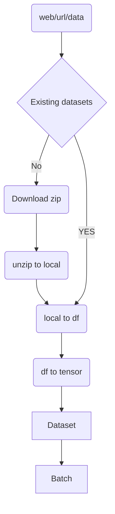
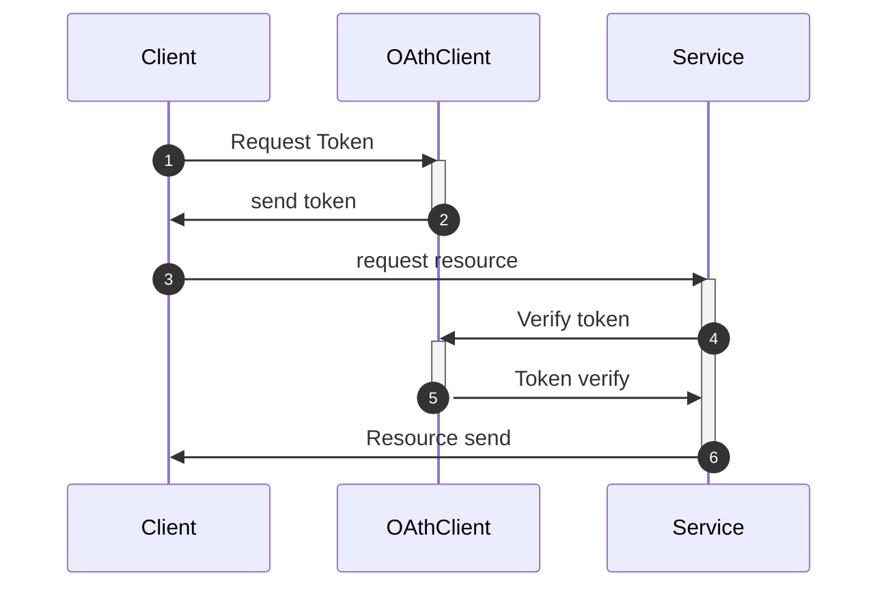
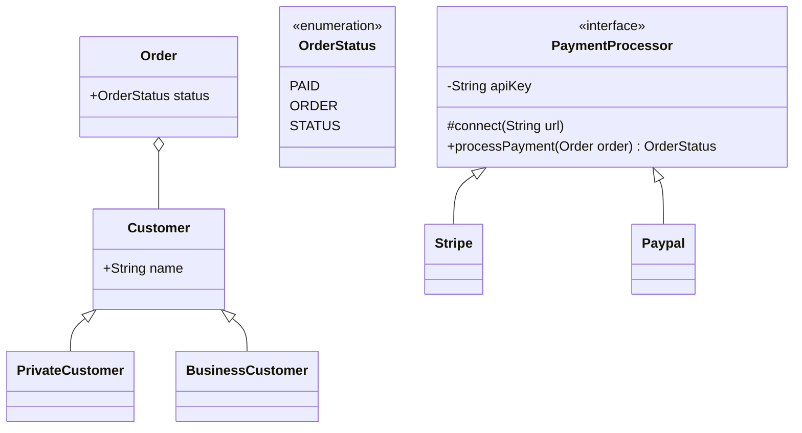
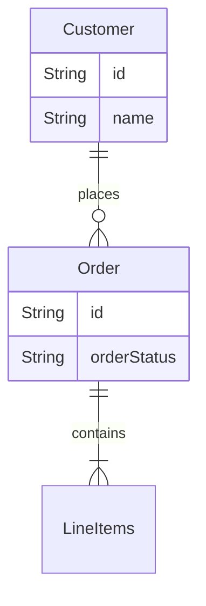

## Fine tuning a the distiled-bert model for sentimen analysis
 distiled-bert-fine-tune

### application schema on mermaid Data transformation

### application schema on mermaid Data transformation

### class diagram

### entity relation diagram
